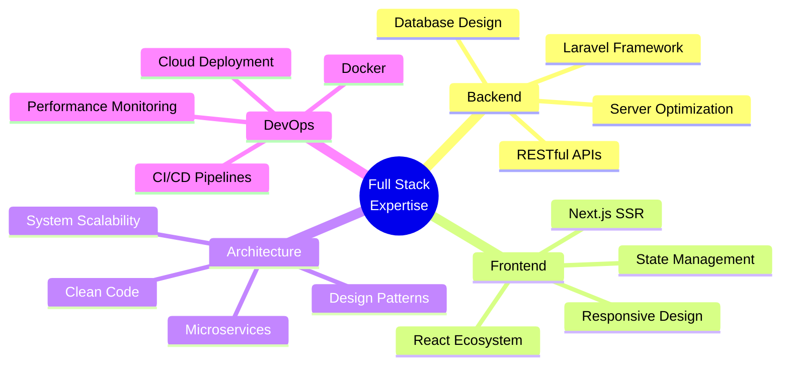

<div align="center">

# Muhammad Arslan

### Senior Full Stack Developer | PHP & Laravel Specialist | React & Next.js Engineer

[](https://git.io/typing-svg)

[](https://github.com/YOUR_USERNAME)
[](https://github.com/YOUR_USERNAME)
[](https://linkedin.com/in/YOUR_LINKEDIN)
[](mailto:YOUR_EMAIL)

</div>

---

## 💼 About Me

<div align="center">

### 👨‍💻 Professional Journey


</div>

<br>

<table>
<tr>
<td width="50%" valign="top">

### 🎯 Who I Am

```yaml
name: Muhammad Arslan
role: Senior Full Stack Developer
location: Lahore, Punjab, Pakistan
experience: 4+ Years in Production
availability: Open for Opportunities

philosophy: |
  "Building scalable solutions that 
  solve real-world problems with 
  clean, maintainable code."
```

**💼 Current Focus:**
- 🚀 Building enterprise-grade SaaS platforms
- 🏗️ Architecting scalable backend systems
- ⚡ Optimizing high-performance applications
- 👥 Mentoring junior developers
- 📚 Contributing to open-source

</td>
<td width="50%" valign="top">

### 💡 What I Do Best

<details open>
<summary><b>🔧 Backend Engineering</b></summary>

```diff
+ Laravel Framework (MVC, ORM, Events)
+ RESTful API Design & Development
+ Database Architecture & Optimization
+ Microservices & System Integration
+ Performance Tuning & Caching
```
</details>

<details>
<summary><b>🎨 Frontend Development</b></summary>

```diff
+ React.js & Next.js Applications
+ Server-Side Rendering (SSR)
+ State Management (Redux, Zustand)
+ Responsive UI/UX Implementation
+ Progressive Web Apps (PWA)
```
</details>

<details>
<summary><b>🏗️ Architecture & DevOps</b></summary>

```diff
+ Clean Architecture Principles
+ SOLID Design Patterns
+ Docker Containerization
+ CI/CD Pipeline Setup
+ Cloud Infrastructure (AWS)
```
</details>

</td>
</tr>
</table>

<br>

<div align="center">

### 🎓 Areas of Expertise

<table>
<tr>
<td align="center" width="20%">

<br><strong>Backend</strong>
<br><sub>PHP • Laravel • Node.js</sub>
</td>
<td align="center" width="20%">

<br><strong>Frontend</strong>
<br><sub>React • Next.js • Vue</sub>
</td>
<td align="center" width="20%">

<br><strong>Database</strong>
<br><sub>MySQL • PostgreSQL</sub>
</td>
<td align="center" width="20%">

<br><strong>API Design</strong>
<br><sub>REST • GraphQL</sub>
</td>
<td align="center" width="20%">

<br><strong>Performance</strong>
<br><sub>Optimization • Scaling</sub>
</td>
</tr>
</table>

### 📊 By The Numbers

<table>
<tr>
<td align="center">

</td>
<td align="center">

</td>
<td align="center">

</td>
<td align="center">

</td>
</tr>
</table>

</div>

<br>

<div align="center">

```javascript
// My Development Approach
const developmentApproach = {
  planning: "Understand the problem deeply before coding",
  coding: "Write clean, self-documenting code",
  testing: "Comprehensive unit & integration tests",
  deployment: "Automated CI/CD with zero-downtime",
  monitoring: "Proactive performance monitoring",
  iteration: "Continuous improvement based on metrics"
};

// What Drives Me
const motivation = {
  challenge: "Complex problems that push boundaries",
  impact: "Solutions that make a real difference",
  growth: "Learning new technologies & patterns",
  quality: "Code that I'm proud to maintain"
};
```

</div>

---

## 🛠️ Technical Stack

<div align="center">

### Backend Development


### Frontend Development


### Mobile Development


### Database & Tools


</div>

---

## 💻 Featured Projects

<details open>
<summary><b>🏢 Euroso Metrics - Business Intelligence Platform</b></summary>
<br>

**Enterprise data intelligence system for KPI tracking and business analytics**

```yaml
Project Type: SaaS Platform
Industry: Business Intelligence & Analytics
Role: Lead Full Stack Developer

Key Features:
  - Real-time KPI dashboards with customizable widgets
  - Automated data collection from multiple sources
  - Advanced analytics and market comparison tools
  - Automated reporting and data visualization
  - Multi-tenant architecture with RBAC

Technology Stack:
  Backend: Laravel 10, PHP 8.2, MySQL, Redis
  Frontend: React 18, Chart.js, Material-UI
  Architecture: RESTful API, Microservices, Queue System

Impact:
  - Processes 1M+ data points daily
  - 75% reduction in report generation time
  - Supports 50K+ concurrent users
  - 99.9% data accuracy rate
```

</details>

<details>
<summary><b>🛒 Enterprise POS Management System</b></summary>
<br>

**Comprehensive Point-of-Sale solution for retail businesses**

```yaml
Project Type: Enterprise Management System
Industry: Retail & Wholesale
Role: Full Stack Developer

Core Modules:
  - Sales & Purchase Management
  - Real-time Inventory Tracking
  - Advanced Analytics & Reporting
  - Role-based User Management
  - Barcode Integration
  - Multi-payment Gateway Support

Technology Stack:
  Backend: Laravel, MySQL, Queue Processing
  Frontend: React, Redux, Ant Design
  Features: Real-time Updates, Multi-location Support

Business Impact:
  - 100+ retail locations
  - 40% reduction in checkout time
  - 99.8% inventory accuracy
  - Multi-currency support
```

</details>

<details>
<summary><b>🏥 Healthcare Management System</b></summary>
<br>

**HIPAA-compliant medical practice management platform**

```yaml
Project Type: Healthcare SaaS
Industry: Healthcare & Medical
Role: Senior Backend Developer

Key Capabilities:
  - Electronic Health Records (EHR)
  - Appointment Scheduling System
  - Prescription Management
  - Lab Report Integration
  - Multi-doctor & Staff Management
  - Patient Portal & Communication

Technology Stack:
  Backend: Laravel, PostgreSQL, Secure API
  Frontend: React, TypeScript
  Security: Data Encryption, Audit Logs, HIPAA Compliance

Features:
  - HIPAA-compliant data security
  - SMS/Email appointment reminders
  - Digital prescription management
  - Multi-clinic support
  - Telemedicine integration ready
```

</details>

<details>
<summary><b>🎓 Learning Management System (LMS)</b></summary>
<br>

**Modern e-learning platform for course delivery and management**

```yaml
Project Type: E-learning Platform
Industry: Education Technology
Role: Full Stack Developer

Platform Features:
  - Course Creation & Management
  - Video Lecture System with Progress Tracking
  - Quiz & Assessment Engine
  - Certificate Generation
  - Student Progress Analytics
  - Discussion Forums & Live Chat
  - Payment Integration (Stripe, PayPal)
  - Mobile-responsive Design

Technology Stack:
  Backend: Laravel, MySQL, Broadcasting (Pusher)
  Frontend: Next.js, TypeScript, Tailwind CSS
  Media: AWS S3, Video Streaming, CDN

Performance Metrics:
  - 10,000+ concurrent students supported
  - 500+ courses hosted
  - 99.99% uptime
  - < 2s average page load time
  - Real-time notifications
```

</details>

---

## 📊 GitHub Statistics

<div align="center">
  
  
</div>

<div align="center">
  
</div>

<div align="center">
  
</div>

---

## 🏆 Achievements & Certifications

<div align="center">

| Achievement | Description |
|------------|-------------|
| 🎯 **4+ Years Experience** | Professional Full Stack Development |
| 🚀 **50K+ Users** | Applications serving enterprise scale |
| 📊 **1M+ Data Points** | Daily processing in analytics platforms |
| ⚡ **99.9% Uptime** | High-availability system architecture |
| 🏆 **100+ Projects** | Successfully delivered applications |
| 👥 **Team Leadership** | Led development teams & mentored juniors |

</div>

---

## 💡 Development Approach

<table>
<tr>
<td width="33%" align="center">

### 🎯 Architecture
- Clean Code Principles
- SOLID Design Patterns
- Scalable System Design
- Microservices Architecture
- API-First Development

</td>
<td width="33%" align="center">

### ⚡ Performance
- Database Optimization
- Caching Strategies
- Code Profiling
- Lazy Loading
- Asset Optimization

</td>
<td width="33%" align="center">

### 🔒 Security
- OWASP Best Practices
- Data Encryption
- Authentication & Authorization
- Security Audits
- Compliance Standards

</td>
</tr>
</table>

---

## 🎓 Expertise Areas

<div align="center">



</div>

---

## 🤝 Let's Connect

<div align="center">

### 📫 Get In Touch

<a href="https://linkedin.com/in/YOUR_LINKEDIN">
  
</a>
<a href="mailto:YOUR_EMAIL">
  
</a>
<a href="https://github.com/YOUR_USERNAME">
  
</a>
<a href="YOUR_PORTFOLIO">
  
</a>
<a href="https://twitter.com/YOUR_TWITTER">
  
</a>

---

### 💼 Available For

<table>
<tr>
<td align="center" width="33%">

**💻 Freelance Projects**

Custom web applications
API development
System optimization

</td>
<td align="center" width="33%">

**🏢 Full-time Opportunities**

Remote positions
Senior developer roles
Technical leadership

</td>
<td align="center" width="33%">

**🤝 Consulting**

Architecture review
Code audit
Technical advisory

</td>
</tr>
</table>

---

### 📍 Contact Details

| Info | Details |
|------|---------|
| 📧 Email | YOUR_EMAIL |
| 💼 LinkedIn | [Muhammad Arslan](https://linkedin.com/in/YOUR_LINKEDIN) |
| 🌐 Portfolio | YOUR_PORTFOLIO_WEBSITE |
| 📍 Location | Lahore, Punjab, Pakistan |
| ⏰ Timezone | PKT (UTC+5) |
| 💬 Languages | English, Urdu |

</div>

---

## 🌟 Professional Values

<div align="center">

> *"Quality is not an act, it is a habit."* - Aristotle

**Code Quality** • **Clean Architecture** • **Performance Excellence**

**Continuous Learning** • **Team Collaboration** • **Problem Solving**

</div>

---

<div align="center">

### ⚡ Quick Stats


</div>

---

<div align="center">

**🚀 Transforming Ideas Into Scalable Digital Solutions**


</div>

---

<div align="center">
  
  
  <sub>Last Updated: May 2026</sub>
</div>
